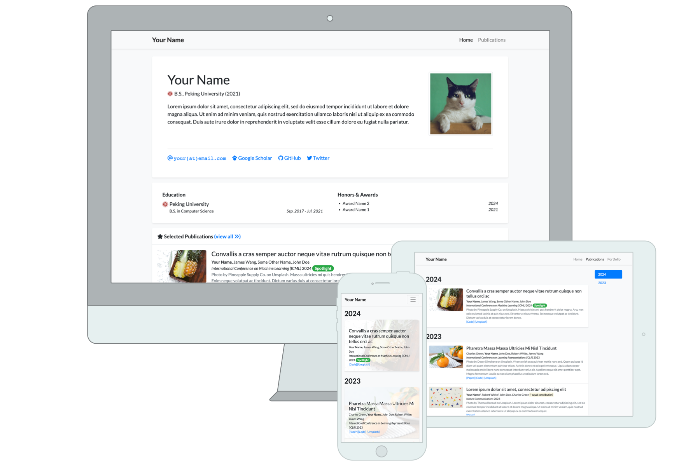

# Junhang Cheng — Academic Homepage

[](https://cjhcoder7.github.io/)
[](LICENSE)

Source code for my personal academic homepage: **[cjhcoder7.github.io](https://cjhcoder7.github.io/)**.

> This repository is a personalized fork of [luost26/academic-homepage](https://github.com/luost26/academic-homepage), created by [Shitong Luo](https://github.com/luost26). The original project is a Jekyll template for building personal academic websites.



## Highlights

- Responsive academic profile built with Jekyll and GitHub Pages
- Dedicated publication page with year-based navigation
- Light and dark themes with mobile-friendly controls
- Keyboard navigation and a command palette for quick access
- Content-driven configuration through YAML and Markdown files

## Repository Structure

```text
.
├── _config.yml          # Site metadata and Jekyll configuration
├── _data/               # Profile, navigation, display, and author data
├── _publications/       # Publication entries grouped by year
├── _includes/           # Reusable page components
├── _layouts/            # Page layouts
├── assets/              # Styles, scripts, images, fonts, and CV
├── index.html            # Homepage
└── publications.html     # Full publication list
```

## Updating the Website

Most content can be maintained without changing the page templates:

- Edit personal information, education, experience, and awards in [`_data/profile.yml`](_data/profile.yml).
- Add or update papers in [`_publications/`](_publications/).
- Adjust navigation in [`_data/navigation.yml`](_data/navigation.yml).
- Control homepage sections in [`_data/display.yml`](_data/display.yml).
- Update site title, description, URL, and build settings in [`_config.yml`](_config.yml).
- Replace images, publication covers, or the CV under [`assets/`](assets/).

A publication entry uses YAML front matter similar to the following:

```yaml
---
title: "Paper Title"
date: 2026-01-01 00:00:00 +0800
selected: true
pub: "Conference or Journal"
pub_date: "2026"
cover: /assets/images/covers/example.png
authors:
  - Junhang Cheng
links:
  Paper: https://arxiv.org/abs/xxxx.xxxxx
  Code: https://github.com/username/repository
---
```

## Local Development

Make sure Ruby, Bundler, and the Jekyll prerequisites are installed, then run:

```bash
git clone git@github.com:cjhCoder7/cjhCoder7.github.io.git
cd cjhCoder7.github.io
bundle install
bundle exec jekyll serve
```

Open the local address shown in the terminal, usually `http://127.0.0.1:4000`.

If cached files cause unexpected results, rebuild the site with:

```bash
bundle exec jekyll clean
bundle exec jekyll serve
```

## Deployment

This repository is configured as a GitHub user site. After GitHub Pages is enabled for the repository, updates pushed to the publishing branch are built and deployed automatically.

## Upstream / Fork Information

| Item | Original project information |
| --- | --- |
| Project | [`academic-homepage`](https://github.com/luost26/academic-homepage) |
| Author | [Shitong Luo (`luost26`)](https://github.com/luost26) |
| Description | A GitHub Pages and Jekyll template for personal academic websites |
| Original demo | [luost.me/academic-homepage](https://luost.me/academic-homepage/) |
| License | [MIT License](https://github.com/luost26/academic-homepage/blob/main/LICENSE) |

The upstream repository provides the original layouts, components, configuration structure, and deployment instructions. This fork retains that foundation while adding my own academic content and further customizations to the visual style, interactions, command palette, theme controls, and mobile experience.

For the upstream user community, FAQs, issue tracker, and original setup guide, see the [original README](https://github.com/luost26/academic-homepage#readme).

Thanks to Shitong Luo and the contributors to the original project for making the template publicly available.

This fork remains available under the [MIT License](LICENSE). The repository preserves the original copyright and license notice; please retain it when reusing the code.
